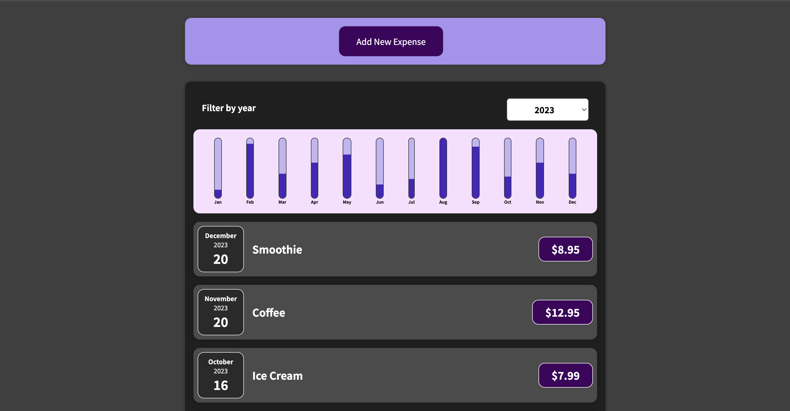

# React-Expense-Tracker

Welcome to the React-Expense-Tracker, an innovative financial management tool crafted using React, CSS, and JSX. It's now available on Heroku for seamless access.

<strong>Experience the application live <a href="https://react-expense-tracker-bc6693da7bef.herokuapp.com/"><b>here</b></a>.</strong>

# About Me
Hello, I'm Mauro Leos, a dedicated Software Engineer who's passionate about creating practical solutions. The React-Expense-Tracker is a testament to my commitment to crafting user-friendly applications that make financial tracking a breeze.

# Summary
The React-Expense-Tracker empowers users to effortlessly manage their expenses. It simplifies the process of adding items, prices, and dates, ensuring accurate and efficient tracking.

# Get in Touch
Connect with me on <a href="https://www.linkedin.com/in/mauro-leos-b4103a11b/">LinkedIn</a> or explore more about me on my <a href="https://www.mauroleos.com/">personal website</a>.
